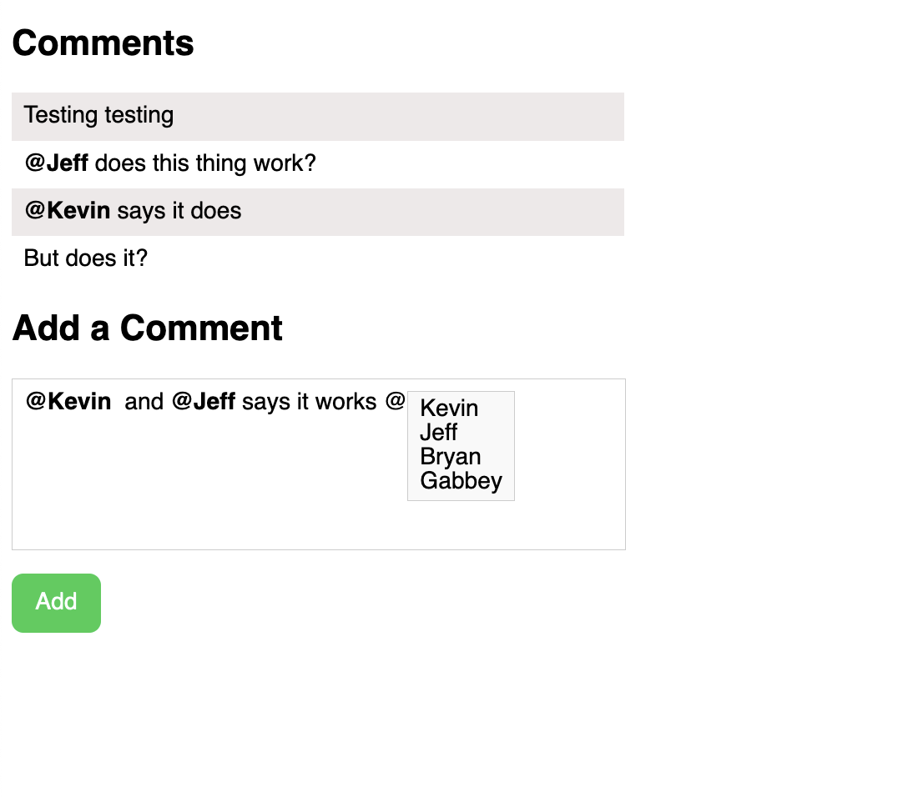

# Comment App

This application provides a simple commenting feature where users can view comments, add comments, and tag users in their comments.
When a user is added a basic js alert is fired off with the user's name.
This app was made with the requirement to not use an existing rich text editor or wysiwyg library

## Screenshots

 
 

## Prerequisites

Before running this app, ensure you have the following software installed on your system:

- [Node.js](https://nodejs.org/)
- [Angular CLI](https://cli.angular.io/)

You can install Angular CLI by running the following command: `npm install -g @angular/cli`

## Getting Started

1. **Install dependencies**

   Navigate to the root directory of the project and run the following command: `npm install`

2. **Start the app**

   Start the app by running the following command: `ng serve`

   The application will start and be available at [http://localhost:4200](http://localhost:4200).

## TODOs

1. Allow tags to be added from anywhere inside the comment form
2. Delete the `<strong>` markup when backspacing inside the comment form when inside or backspacing before markup
3. Allow keyboard navigation
